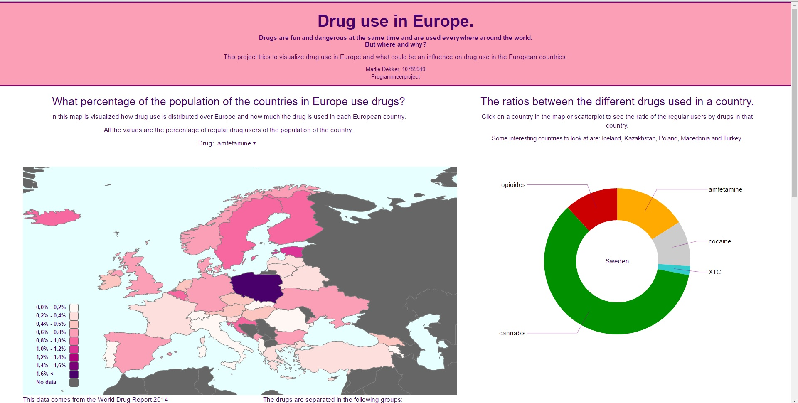
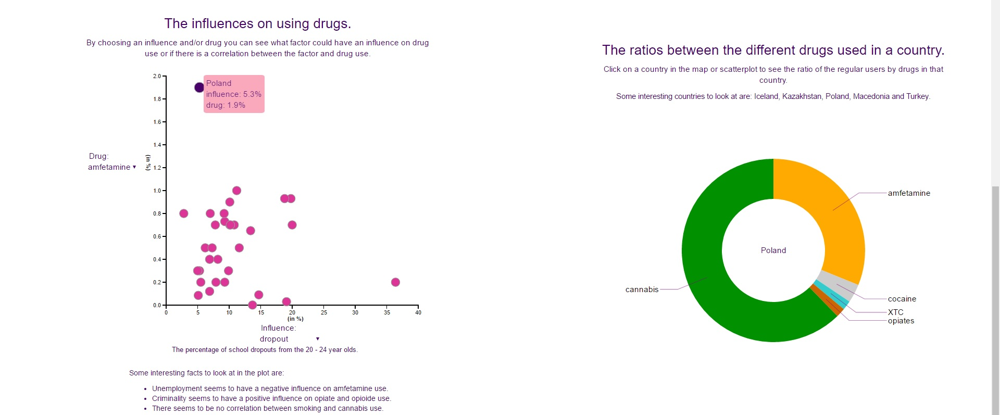

# Report.
###### By Marije Dekker, 10785949
###### Programmeerproject
##### With this project you can see the distribution of drug use, with six different drug groups, over Europe, with a choroplethmap. Furthermore you can see the ratios of the different drug groups in one country with a donutchart. Beside that you can see if there is a correlation between an assumed cause of drug use and the use of one of the druggroups.

#### Problem:
##### Bij deze visualizatie kan iemand kijken wat de relevante oorzaken voor drugsgebruik, voor verschillende drugs, per land, kunnen zijn.
#### Features:
##### In deze dataset wordt het drugsgebruik, van Europa, weergegeven. Dit wordt gedaan per drugs, zoals cannabis, XTC en opiaten. Het wordt weergegeven in procenten van de landelijke bevolking wat deze drugs gebruikt. Dit wordt weergegeven in een choropleth map. Hierbij komt een dropdown menu te staan waaruit uit verschillende drugs gekozen kan worden. Hierbij is een dataset van het world drug report 2014. 
##### Wanneer er op een land wordt geklikt verschijnen er in donut charts de gegevens in percentages van de bevolking over dat land. Per donut komt er een nieuw gegeven. Deze gegevens worden dingen die waarschijnlijk invloed hebben op drugsgebruik, zoals criminaliteit, armoede, alcoholgebruik, mentale gezondheid, roken, etc.
##### Onder de donutcharts komt er een barchart waar dat percentage van de invloed vergeleken wordt met de andere europese landen.
##### Verder kan er gekeken worden waar welke drugs vandaan komt enzo, mits dat vindbaar is. Dit kan bij de wereldmap worden weergegeven en dit kan aan of uitgezet worden. (deze component is nog niet uitgewerkt en is optioneel!)
#### Datasets:
##### Als datasets komen er twee of drie JSON-files. 1 over het drugsgerbuik per land en nog 1 of meer over de andere gegevens zoals criminaliteit over dat land. Deze gaan waarschijnlijk in een queue ingeladen worden.
#### Exteral components:
##### Er wordt gebruik gemaakt van de D3 library en voor de mooimaak van de pagina, waarschijnlijk bootstrap.
#### Ontwerp: